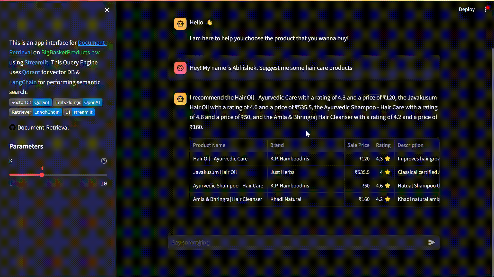

# Document-Retrieval (Qdrant+LangChain+FastAPI)
[](https://github.com/qdrant/qdrant)
[](https://platform.openai.com/docs/guides/embeddings/what-are-embeddings)
[](https://github.com/langchain-ai/langchain)
[](https://streamlit.io/) \
This repo is an implementation of [Document Retrieval](https://python.langchain.com/docs/modules/data_connection/) as part of the Assignment of chaabi for SDE-1 role - Placements'23. This Query Engine uses [Qdrant](https://github.com/qdrant/qdrant) for vector database, [LangChain](https://github.com/langchain-ai/langchain) for performing semantic search and [Streamlit](https://streamlit.io/) for user-interface. The DB is hosted on Qdrant Cloud as a cluster with a collection of vectors. I've used [OpenAIEmbeddings](https://platform.openai.com/docs/guides/embeddings/what-are-embeddings) for embedding the vectors.

## DocRetrieval in action


## How does it work?
The search engine uses [RetrievalQAWithSourcesChain](https://js.langchain.com/docs/modules/chains/popular/vector_db_qa) along with [ConversationSummaryMemory](https://python.langchain.com/docs/modules/memory/types/summary) to store chat history and use it as a context along with the retrived documents from QdrantDB to answer any follow up question. This whole process is also known as [Retrieval-augmented generation](https://python.langchain.com/docs/use_cases/question_answering/)

I've used a custom Prompt Template to cater to this specific use case, which incorporates summarized chat history as a context while answering any follow up question. Look how the context is added in the below prompt:

       About: You are a Product Recommendation Agent who gets his context from the retrieved descriptions of the products that matches best with the User's query. User is a human who, as a customer, wants to buy a product from this application.

       Given below is the summary of conversation between you (AI) and the user (Human):
    💡Context: The AI recommends the Hair Oil - Ayurvedic Care by K.P. Namboodiris, rated 4.3 with a price of ₹120, and the Javakusum Hair Oil by Just Herbs, rated 4.0 with a price of ₹535.5, as hair care products.

       Now use this summary of previous conversations and the retrieved descriptions of products to answer the following question asked by the user:
    ❓Question: What are the prices of the products you mentioned earlier?

       Note: While answering the question, give only one short sentence description along with rating and price (in INR ₹) for each retrived product. Do not give any unnecessary information. Also, do not repeat the information that is already present in the context. The answer should be crisp so that it can fit the token limit. The tone of the answer should be like a polite and friendly AI Assistant.

## API
I've used FastAPI for the retreival service which can be ran with curl command as follows:
```
curl -X 'GET' \
  'http://127.0.0.1:8000/api/search?q=Hey%21%20My%20name%20is%20Abhishek.%20Suggest%20me%20some%20hair%20care%20products&num_results=2' \
  -H 'accept: application/json'
```
Response:
```
{
  "result": {
    "answer": "I recommend the Hair Oil - Ayurvedic Care by K.P. Namboodiris (rating: 4.3, price: ₹120), Javakusum Hair Oil by Just Herbs (rating: 4.0, price: ₹535.5), and Ayurvedic Shampoo - Hair Care by K.P. Namboodiris (rating: 4.6, price: ₹50).\n",
    "products": [
      {
        "product": "Hair Oil - Ayurvedic Care",
        "brand": "K.P. Namboodiris",
        "sale_price": 120,
        "rating": 4.3,
        "description": "Improves hair growth, prevents hair loss, prevent premature greying of hair and fight against dandruff.  For Beauty tips, tricks & more visit https://bigbasket.blog/"
      },
      {
        "product": "Ayurvedic Shampoo - Hair Care",
        "brand": "K.P. Namboodiris",
        "sale_price": 50,
        "rating": 4.6,
        "description": "Natual Shampoo that conditions from deep within, gently cleansing, nourishing the hairs to keep hair strong, soft and shining.  For Beauty tips, tricks & more visit https://bigbasket.blog/"
      }
    ]
  }
}
```

## Setup
Install all required modules
```
pip install -r requirements.txt
```
Setup .env file at root directory of this repo having following fields:
```
QDRANT_URL="your-qdrant-url"
QDRANT_API_KEY="your-qdrant-api-key"
COLLECTION_NAME="big-basket-products"
OPENAI_API_KEY="your-openai-api-key"
FILE_PATH="data/bigBasketProducts.csv"
```

### Create Collection
Create collection and Upload embeddings. (Do this only if you want to change the DB)
```
cd backend
python init_collections_products.py
```

### Perform Search
Search for the best match vectors stored in DB.
```
python service.py
```
Now open http://127.0.0.1:8000/docs in your browser and put the value of `q` (question) in query.


## Running Streamlit App
You can also use the web interface for running the application.
```
cd frontend
streamlit run app.py
```

### Setting Search Parameter (K)
You can set the search parameter `K` that controls the maximum number of products the retrieval chain can fetch.


### Sorting Results
After getting the products, you can sort them on the basis of Sale Price and Rating.



## Colab Notebook
Complete Code (dev) for performing DocRetrieval over bigBasketProducts.csv could be found in [Colab Notebook](https://colab.research.google.com/github/AbhishekPardhi/Document-Retrieval/blob/main/test.ipynb)

[](https://colab.research.google.com/github/AbhishekPardhi/Document-Retrieval/blob/main/test.ipynb)

## Limitations and Future Scope
Currently it takes $30$ seconds (with $K=2$) to get answer from the model. This can be improved further by using a smaller model (having less number of parameters) and/or by using quantization while adding texts to the vectorDB. Inference speed can also be increased by caching the retriever chain.
